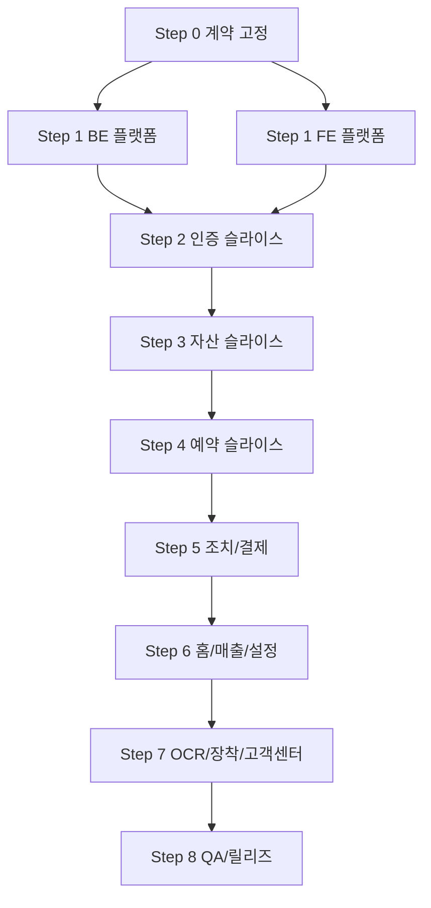

# 6단계: Jira 백로그 티켓 분해 + 실행 순서도

## 1. 사용 목적
- Jira에 백로그 등록하기 전에 티켓 단위를 확정한다.
- FE 레포(`pangea-front`)와 BE 레포(`_legacy/Project_Prometheus_BE`)를 같은 로드맵에서 관리한다.

## 2. Epic 구조 (제안)

| Epic Key (임시) | Epic Name | 범위 |
|---|---|---|
| EP-001 | Contract & Program Setup | 용어집, OpenAPI 초안, Jira 운영 규칙 |
| EP-002 | BE V2 Platform | `/api/v2` 골격, 공통 응답/에러, 인증/테넌시, DB 인덱스 |
| EP-003 | FE Runtime Platform | API 클라이언트, Auth/Company 컨텍스트, 공통 UX |
| EP-004 | Core Domain Integration | 자산/예약/조치/결제/홈/매출/설정 연동 |
| EP-005 | Ops & Premium Integration | OCR/업로드/장착신청/고객센터/장착작업 연동 |
| EP-006 | QA & Release | 통합 테스트, 보안/테넌시 회귀, 스테이징/릴리즈 |

## 3. 실행 순서도 (의존성 기반)

## 4. Ticket Backlog (등록 순서 기준)

| Order | Temp ID | Repo | Type | Epic | Summary | Priority | Depends On | 완료 기준(핵심) |
|---:|---|---|---|---|---|---|---|---|
| 1 | BK-001 | FE+BE | Task | EP-001 | FE/BE 공통 용어집 확정 | Highest | - | `vehicleNumber/vin/plate`, `reservation/rental`, `status` 용어 고정 |
| 2 | BK-002 | BE | Story | EP-001 | OpenAPI v2 초안 작성 | Highest | BK-001 | 인증/자산/예약/조치/결제/매출/설정 최소 스펙 문서화 |
| 3 | BK-003 | FE+BE | Task | EP-001 | Jira 운영 규칙 확정 | High | BK-001 | 라벨, 컴포넌트, DoR/DoD, 의존성 표기 규칙 확정 |
| 4 | BK-010 | BE | Story | EP-002 | `/api/v2` 라우팅 스켈레톤 추가 | Highest | BK-002 | v2 블루프린트 구조와 health endpoint 동작 |
| 5 | BK-011 | BE | Story | EP-002 | 공통 응답/에러 포맷 통일 | Highest | BK-010 | 성공/실패 응답 구조 일관, 에러 타입 표준화 |
| 6 | BK-012 | BE | Story | EP-002 | v2 인증 + tenant guard 적용 | Highest | BK-010 | role/tenant 기반 접근 제어 및 401/403 규칙 적용 |
| 7 | BK-013 | BE | Story | EP-002 | 신규 컬렉션/인덱스 마이그레이션 | Highest | BK-010 | `payments`, `action_items`, `device_installations` 생성+인덱스 |
| 8 | BK-020 | FE | Story | EP-003 | 공통 API 클라이언트 구축 | Highest | BK-002 | 토큰 주입, timeout, 에러 표준화, 인터셉터 동작 |
| 9 | BK-021 | FE | Story | EP-003 | AuthContext JWT 기반 교체 | Highest | BK-020,BK-012 | login/me/logout 흐름과 세션 복원 동작 |
| 10 | BK-022 | FE | Story | EP-003 | CompanyContext 도입 | High | BK-020 | 회사 정보 조회/갱신 전역 상태 동작 |
| 11 | BK-023 | FE | Task | EP-003 | 공통 loading/error/empty UI | High | BK-020 | 페이지 공통 fallback UI 적용 |
| 12 | BK-030 | BE | Story | EP-002 | v2 auth API(login/me/logout) 구현 | Highest | BK-011,BK-012 | FE가 필요한 인증 API 계약 충족 |
| 13 | BK-031 | FE | Story | EP-003 | 로그인/보호 라우트 연동 | Highest | BK-021,BK-030 | 비인증 접근 차단, 로그인 후 라우팅 정상 |
| 14 | BK-032 | FE | Task | EP-003 | 로그아웃/만료 처리 UX 정리 | High | BK-031 | 토큰 만료 시 자동 로그아웃/안내 |
| 15 | BK-040 | BE | Story | EP-004 | v2 assets 조회 API(list/detail) | Highest | BK-011,BK-013 | 자산 목록/상세 응답 DTO 제공 |
| 16 | BK-041 | BE | Story | EP-004 | v2 assets 쓰기 API(create/patch/history) | Highest | BK-040 | 등록/수정/히스토리 API 동작 |
| 17 | BK-042 | FE | Story | EP-004 | Assets 페이지 조회 연동 | Highest | BK-040,BK-031 | 목록/필터/상세 데이터 API 기반 렌더링 |
| 18 | BK-043 | FE | Story | EP-004 | Assets 수정/등록 연동 | Highest | BK-041,BK-042 | 상세 수정/등록이 서버 반영 |
| 19 | BK-044 | FE | Task | EP-004 | Assets mock 제거 | High | BK-043 | `mockData` 의존 제거(자산 범위) |
| 20 | BK-050 | BE | Story | EP-004 | v2 reservations 조회/쓰기 API | Highest | BK-011,BK-013 | 목록/생성/수정/반납/사고등록 지원 |
| 21 | BK-051 | BE | Story | EP-004 | 계약 상태전환 API(v2) 연동 | High | BK-050 | 상태머신 규칙 기반 전환/검증 동작 |
| 22 | BK-052 | FE | Story | EP-004 | Reservations 조회 연동 | Highest | BK-050,BK-031 | 캘린더/필터/상세 데이터 API 기반 동작 |
| 23 | BK-053 | FE | Story | EP-004 | Reservations 쓰기 연동 | Highest | BK-052,BK-051 | 계약 등록/반납/사고 등록 서버 반영 |
| 24 | BK-054 | FE | Task | EP-004 | Reservations mock 제거 | High | BK-053 | 예약 mock import 제거 |
| 25 | BK-060 | BE | Story | EP-004 | payments API + 컬렉션 구현 | Highest | BK-013,BK-011 | 결제 목록/상태변경/미납 집계 제공 |
| 26 | BK-061 | BE | Story | EP-004 | action-items API 구현 | Highest | BK-013,BK-011 | 조치항목 조회/상태변경/메모 추가 가능 |
| 27 | BK-062 | FE | Story | EP-004 | ActionRequired 조회 연동 | Highest | BK-061,BK-060 | 이슈/미납 통합 조회 API 연결 |
| 28 | BK-063 | FE | Story | EP-004 | ActionRequired 쓰기 연동 | High | BK-062 | 해결처리/메모 추가 서버 반영 |
| 29 | BK-064 | FE | Story | EP-004 | 결제상태 연동 통합(예약/홈/조치) | High | BK-060,BK-053,BK-062 | 결제 상태 변경이 관련 화면 동기화 |
| 30 | BK-065 | FE | Task | EP-004 | Action/Payment mock 제거 | High | BK-064 | `paymentUtils mockPayments` 의존 제거 |
| 31 | BK-070 | BE | Story | EP-004 | 홈 집계 API 제공 | Highest | BK-060,BK-061,BK-050 | 오늘할일/상태카운트/분포 집계 제공 |
| 32 | BK-071 | BE | Story | EP-004 | 매출 집계 API 제공 | High | BK-060,BK-050 | 주/월/연 요약 + 차트 데이터 제공 |
| 33 | BK-072 | BE | Story | EP-004 | company/geofences/members v2 정리 | High | BK-011,BK-012 | 설정 화면 연동 가능한 API 정리 |
| 34 | BK-073 | FE | Story | EP-004 | Home API 연동 | Highest | BK-070,BK-064 | 홈 통계/카드가 서버 데이터로 동작 |
| 35 | BK-074 | FE | Story | EP-004 | Revenue API 연동 | High | BK-071 | 하드코딩 차트 제거 및 집계 연결 |
| 36 | BK-075 | FE | Story | EP-004 | Settings API 연동 | High | BK-072,BK-022 | 회사/지오펜스/계정관리 저장 동작 |
| 37 | BK-076 | FE | Task | EP-004 | 역할 기반 메뉴/권한 하드닝 | High | BK-031,BK-075 | 역할별 메뉴/액션 제어 적용 |
| 38 | BK-080 | BE | Story | EP-005 | v2 업로드 서명/세션 API 안정화 | High | BK-011,BK-012 | 파일 업로드 정책/권한/에러 처리 완료 |
| 39 | BK-081 | BE | Story | EP-005 | v2 OCR 추출 어댑터 구현 | High | BK-080 | OCR 추출 결과를 FE DTO로 제공 |
| 40 | BK-082 | BE | Story | EP-005 | terminal-requests API 정리 | Medium | BK-011 | 장착 신청 API 계약 안정화 |
| 41 | BK-083 | BE | Story | EP-005 | support-tickets API 정리 | Medium | BK-011 | 문의 접수 API 계약 안정화 |
| 42 | BK-084 | BE | Story | EP-005 | device-installations API 구현 | Medium | BK-013,BK-011 | 장착 작업 생성/조회/상태 관리 가능 |
| 43 | BK-085 | FE | Story | EP-005 | OCR 플로우 연동(자산/계약) | High | BK-081,BK-043,BK-053 | 업로드 후 OCR 제안 반영 저장 동작 |
| 44 | BK-086 | FE | Story | EP-005 | Premium CTA -> 장착신청 연동 | Medium | BK-082,BK-073 | CTA가 실제 신청 API 호출 |
| 45 | BK-087 | FE | Story | EP-005 | 고객센터 UI/연동 추가 | Medium | BK-083,BK-031 | 문의 등록 UI + API 동작 |
| 46 | BK-088 | FE | Story | EP-005 | DeviceInstallation 서버 연동 | Medium | BK-084,BK-031 | 장착 작업/사진/시리얼 저장 동작 |
| 47 | BK-090 | BE | Story | EP-006 | BE API 통합 테스트 보강 | High | BK-084 | 핵심 v2 엔드포인트 테스트 커버리지 확보 |
| 48 | BK-091 | FE | Story | EP-006 | FE E2E 테스트 보강 | High | BK-088 | 로그인→자산→예약→조치→매출 시나리오 자동화 |
| 49 | BK-092 | FE+BE | Task | EP-006 | 테넌시/권한 보안 회귀 | Highest | BK-090,BK-091 | 교차 테넌트 접근/권한 누락 회귀 통과 |
| 50 | BK-093 | FE+BE | Task | EP-006 | 스테이징 리허설 + 마이그레이션 드라이런 | Highest | BK-092 | 스테이징 E2E와 데이터 검증 완료 |
| 51 | BK-094 | FE+BE | Task | EP-006 | 릴리즈 체크리스트 + 롤아웃 | Highest | BK-093 | 릴리즈/모니터링/롤백 플랜 승인 |
| 52 | BK-095 | FE+BE | Story | EP-006 | 운영 관측성 구축(Sentry/APM/알람) | Highest | BK-094 | FE/BE 에러 추적, 핵심 API 알람, 대시보드 운영 가능 |
| 53 | BK-096 | FE+BE | Story | EP-006 | 성능/부하 테스트 및 튜닝 | High | BK-093 | 핵심 API 부하 기준 통과, FE 성능 임계치 충족 |
| 54 | BK-097 | BE | Story | EP-006 | 보안 하드닝(rate limit/bruteforce/upload 검증) | Highest | BK-012,BK-080 | 인증/업로드 보안 통제 적용 및 회귀 테스트 통과 |
| 55 | BK-098 | BE | Task | EP-006 | 백업/복구 리허설(실행) | Highest | BK-093 | DB 복구 시간/절차 검증, 결과 기록 완료 |
| 56 | BK-099 | FE+BE | Task | EP-006 | 릴리즈 전략(canary/rollback) 자동화 | Highest | BK-094,BK-095 | 카나리 배포 및 원클릭 롤백 절차 검증 완료 |

## 5. 순차 실행 그룹 (시간 미지정)

| Group | 선행 조건 | 포함 Ticket |
|---|---|---|
| S0 | - | BK-001~BK-003 |
| S1 | S0 | BK-010~BK-023 |
| S2 | S1 | BK-030~BK-032 |
| S3 | S2 | BK-040~BK-044 |
| S4 | S3 | BK-050~BK-054 |
| S5 | S4 | BK-060~BK-065 |
| S6 | S5 | BK-070~BK-076 |
| S7 | S6 | BK-080~BK-088 |
| S8 | S7 | BK-090~BK-099 |

## 6. Jira 등록 시 필드 매핑 가이드
- `Summary`: `"[BK-xxx] ..."` 형태로 시작하면 추적이 쉽다.
- `Labels`: `repo-fe`, `repo-be`, `stage-#`, `epic-###`, `priority-*`
- `Components`: `frontend`, `backend`, `integration`, `qa`
- `Description`: 본 문서의 완료 기준 + API 계약 링크 + 테스트 기준 포함
- `Issue Links`: `is blocked by`로 `Depends On` 매핑
